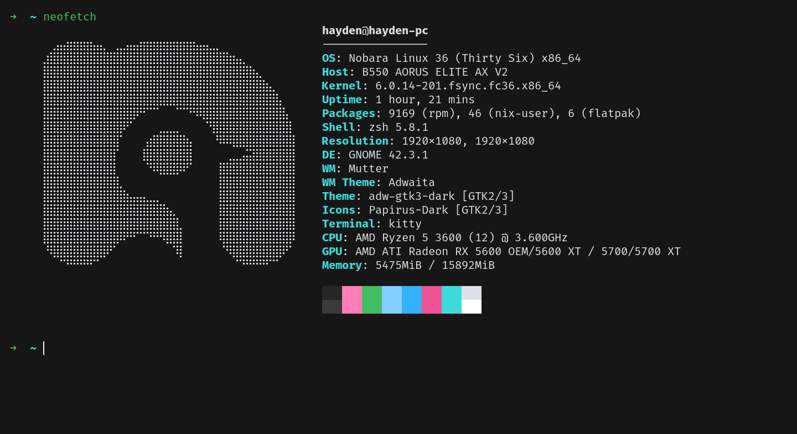
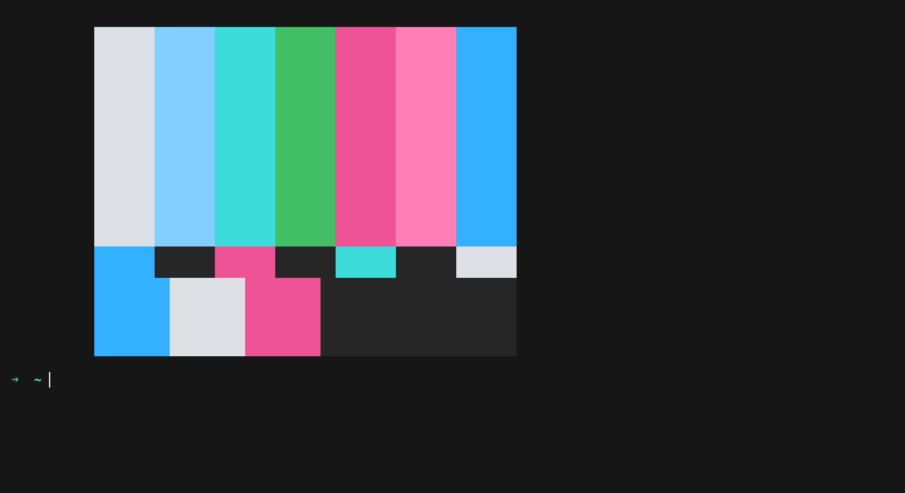
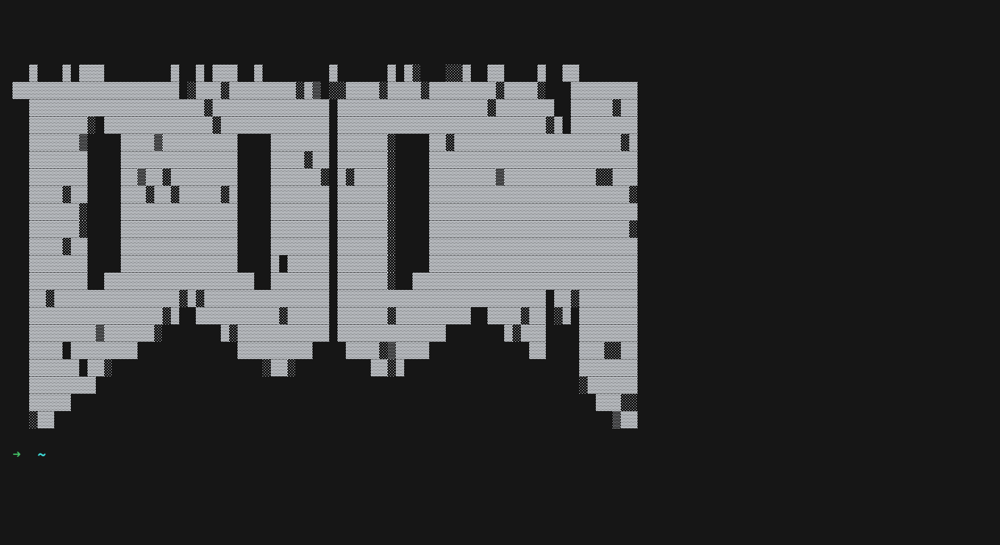

# oxocarbon-kitty

[Oxocarbon](https://github.com/nyoom-engineering/oxocarbon) is a set of community ports of IBM's carbon color palette and design philosophy to various applications and tooling.

## Showcase

## Install

- Copy the contents of [`skin.conf`](./skin.conf) into your `kitty.conf` file.

## License

The project is licensed under the [Apache-2.0 license](./LICENSE)
